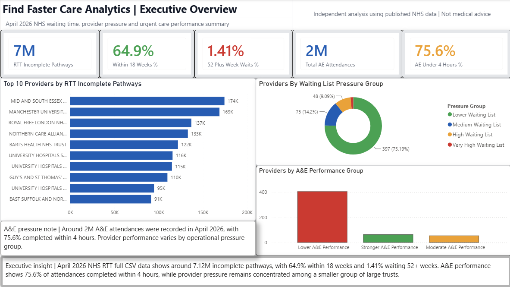
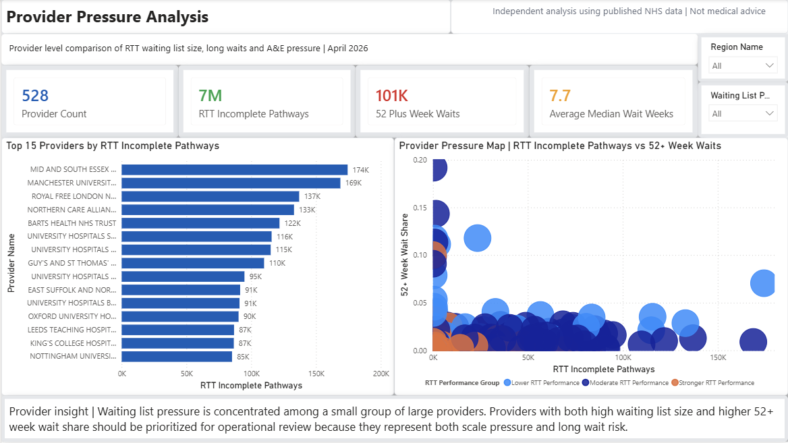
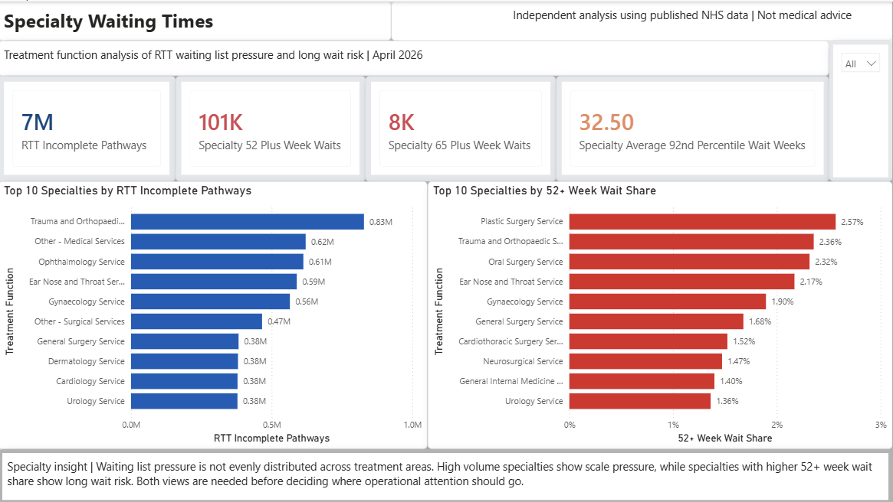
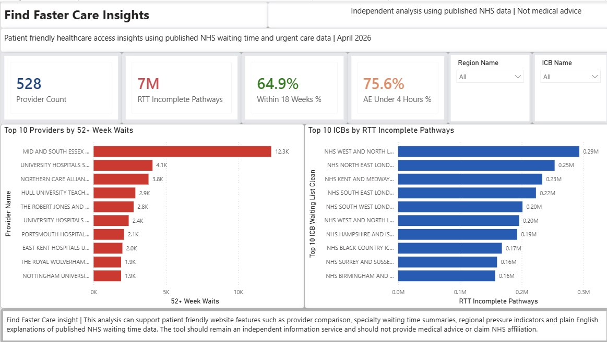

# Find Faster Care Analytics

## Project Overview

Find Faster Care Analytics is a healthcare analytics project that uses published NHS RTT waiting time and urgent care data to analyse provider pressure, specialty waiting times, ICB level system pressure and patient friendly access insights.

The project uses Python, PostgreSQL, SQL, Power BI and DAX to build a full analytics pipeline from raw NHS data to a professional interactive dashboard.

## Business Problem

Public NHS waiting time data is available, but it is not always easy for patients, analysts or non technical users to understand.

This project asks:

How can published NHS waiting time and urgent care data be used to compare provider pressure, identify access delays and support patient friendly healthcare access insights?

## Tools Used

Python | PostgreSQL | SQL | Power BI | DAX | Excel

## Data Sources

This project uses published NHS data for April 2026, including:

1 | NHS RTT full CSV extract for April 2026

2 | RTT incomplete pathway waiting time data

3 | Treatment function level waiting time data

4 | Provider level waiting time data

5 | ICB level waiting time data

6 | A&E provider performance data

The project uses public aggregate healthcare data only. No patient level data was used.

## Data Pipeline

1 | Python was used to extract, inspect and clean the NHS RTT full CSV data.

2 | The RTT data was filtered correctly to avoid double counting between total treatment function rows and specialty level rows.

3 | Provider level KPIs were built using Treatment Function Name = Total.

4 | Specialty analysis excluded Treatment Function Name = Total to avoid double counting.

5 | Clean datasets were exported into CSV files.

6 | PostgreSQL was used to store the cleaned datasets.

7 | SQL views were created to prepare Power BI ready tables.

8 | Power BI was used to build the final dashboard, DAX measures and visual insights.

## Dashboard Pages

### Page 1 | Executive Overview

The Executive Overview page summarises national level access pressure for April 2026.

It includes:

1 | RTT incomplete pathways

2 | Percentage within 18 weeks

3 | Percentage waiting 52 plus weeks

4 | A&E attendances

5 | A&E under 4 hours percentage

6 | Top providers by RTT incomplete pathways

7 | Provider waiting list pressure groups

8 | A&E performance groups

### Page 2 | Provider Pressure Analysis

The Provider Pressure Analysis page compares NHS providers by RTT incomplete pathway volume, long wait risk and A&E pressure.

It includes:

1 | Provider count

2 | RTT incomplete pathways

3 | 52 plus week waits

4 | Average median wait weeks

5 | Top providers by RTT incomplete pathways

6 | Provider pressure scatter map

7 | Region and waiting list pressure slicers

The page helps identify providers with both high waiting list volume and higher long wait risk.

### Page 3 | Specialty Waiting Times

The Specialty Waiting Times page analyses waiting list pressure by treatment function.

It compares:

1 | High volume specialties

2 | Specialties with higher 52 plus week wait share

This matters because high volume specialties and high long wait risk specialties are not always the same.

### Page 4 | Find Faster Care Insights

The Find Faster Care Insights page connects the analysis to the Find Faster Care concept.

It shows how published NHS data can support:

1 | Provider comparison

2 | Specialty waiting time summaries

3 | Regional and ICB level pressure indicators

4 | Plain English explanations of healthcare access data

5 | Patient friendly information design

The dashboard clearly states that it is independent analysis and does not provide medical advice.

## Key Findings

1 | April 2026 NHS RTT full CSV data shows around 7.12M incomplete pathways.

2 | Around 64.9% of RTT incomplete pathways were within 18 weeks.

3 | Around 101K pathways were waiting 52 plus weeks.

4 | Around 1.41% of RTT incomplete pathways were waiting 52 plus weeks.

5 | A&E performance showed around 75.6% of attendances completed within 4 hours.

6 | Waiting list pressure is concentrated among a smaller group of large providers.

7 | Treatment specialties show different patterns between total waiting list size and long wait risk.

8 | ICB level analysis helps identify areas with higher system pressure.

## Business Recommendations

1 | Prioritise providers with both high RTT incomplete pathway volume and higher 52 plus week wait share.

2 | Monitor specialties separately because volume pressure and long wait risk are not the same.

3 | Use ICB level analysis to identify areas with higher system pressure.

4 | Present waiting time data in plain English so public healthcare information is easier to understand.

5 | Keep any patient facing tool independent, transparent and clear that it does not provide medical advice.

6 | Avoid using a single metric alone because provider size, specialty mix and regional context affect interpretation.

## Data Quality And Validation

A key part of this project was identifying and fixing a double counting issue.

The NHS RTT dataset contains both:

1 | Total treatment function rows

2 | Specialty level treatment function rows

If both are summed together, the RTT incomplete pathway total is inflated.

The dashboard was corrected by using:

1 | Treatment Function Name = Total for provider level KPIs

2 | Specialty rows excluding Total for specialty analysis

After correction, the dashboard uses around 7.12M NHS RTT incomplete pathways from the full CSV extract.

## Limitations

1 | The data is published monthly data and does not represent live NHS operational performance.

2 | The project uses aggregate public data, not patient level data.

3 | Waiting time performance is influenced by provider size, case mix, specialty mix and regional context.

4 | The dashboard does not advise patients where to seek treatment.

5 | The project is not affiliated with the NHS.

6 | The dashboard should be used for analysis and information only.

7 | A&E indicators and RTT indicators come from different NHS reporting structures, so they should be interpreted carefully when shown together.

## Screenshots

### Executive Overview

### Provider Pressure Analysis

### Specialty Waiting Times

### Find Faster Care Insights

## Project Files

1 | Power BI dashboard file

2 | Python data cleaning notebook

3 | SQL view creation script

4 | Dashboard screenshots

5 | Case study markdown file

6 | README documentation

## What This Project Demonstrates

This project demonstrates practical ability in:

1 | Healthcare data analysis

2 | Python data cleaning

3 | Data validation

4 | PostgreSQL database handling

5 | SQL view creation

6 | Power BI dashboard design

7 | DAX measure creation

8 | KPI reporting

9 | Provider performance analysis

10 | Specialty performance analysis

11 | ICB level analysis

12 | Business recommendation writing

13 | Translating technical data into plain English insights

## Relevance To Target Roles

This project is relevant for:

Business Analyst

Data Analyst

Healthcare Analyst

Operations Analyst

Market Research Analyst

Management Consulting Analyst

It shows the ability to take messy public healthcare datasets, clean them, validate the logic, build database backed analysis and turn the results into a professional business dashboard.

## Disclaimer

This project is independent analysis using published NHS data.

It is not affiliated with the NHS.

It does not provide medical advice.

It is designed for analytics, portfolio and information design purposes only.